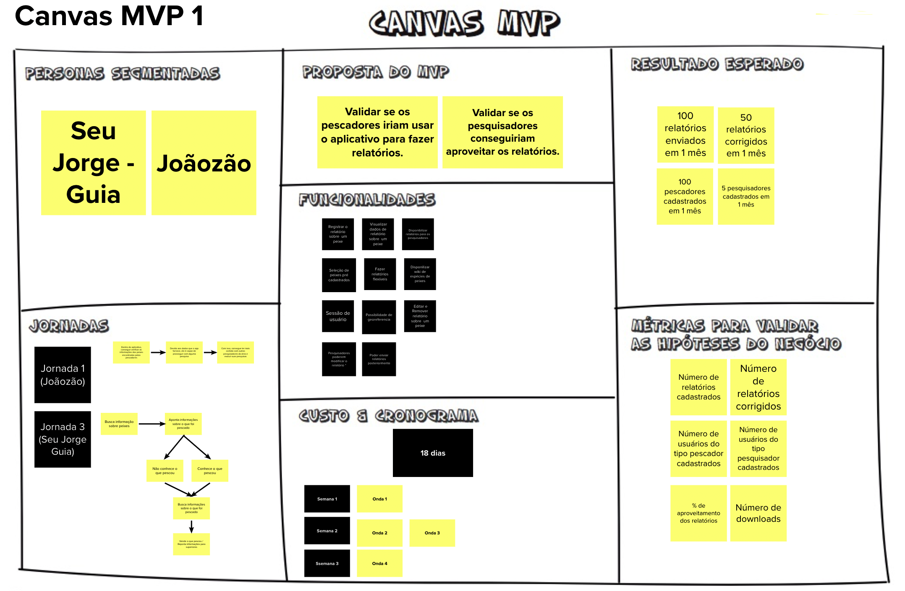

# Canvas MVP

| Data       | Versão | Descrição            | Autor             |
|:----------:|:------:|:--------------------:|:-----------------:|
| 10/08/2021 | 1.0 | Criação do documento do Canvas MVP  | [Lucas Fellipe](https://github.com/lucasfcm9) |
| 14/08/2021 | 1.1 | Adição da versão 2.0 do Canvas MVP  | [Lucas Fellipe](https://github.com/lucasfcm9) |

Reunião realizada no *Discord*.

**Data**: 09 de Agosto de 2021

**Redigida por**: Lucas Fellipe

**Participantes**:

- Daniel Coimbra (MDS)
- Gabriel Freitas (MDS)
- Iuri Severo (EPS)
- João Pedro (EPS)
- Lucas Fellipe (EPS)
- Natan Tavares (MDS)
- João Victor (MDS)
- Paulo Henrique (MDS)
- Pedro Rodrigues (EPS)

Hoje vai acontecer as seguintes atividades: **Canvas MVP**.

## Custo e Cronograma

 &emsp;&emsp;No início da reunião definimos qual seria a quantidade de dias para implementar tal funcionalidade. Cada integrante da equipe colocou em um <i>post-it</i> sua opinião sobre o tempo de esforço para realizar tal atividade. Definimos, por padrão, que trabalhar durante 2 horas seguidas equivale a 1 dia de trabalho. Os valores a seguir foram definidos para o nosso MVP:

- Registrar o relatório sobre um peixe: 4 dias;
- Sessão de usuário: 7 dias;
- Disponibilizar *wiki* de espécies de peixes: 6 dias;
- Visualizar dados de um relatório sobre um peixe: 3 dias;
- Seleção de peixes pré-cadastrados: 3 dias;
- Editar e remover relatórios sobre um peixe: 2 dias;
- Disponibilizar relatórios para os pesquisadores: 4 dias;
- Possibilidade de georeferência: 5 dias;
- Pesquisadores poderem modificar o relatório: 2 dias.

## Canvas MVP

 &emsp;&emsp;Nessa etapa realizamos a atividade de elaborar o Canvas MVP para o produto, que é um quadro visual que auxilia a equipe a alinhar e definir as estratégias do MVP. Todos da equipe participaram e deram suas respectivas opiniões para cada quadro do MVP.

O quadro do Canvas MVP ficou da seguinte forma:
- Proposta do MVP:
  - Validar se os pescadores iriam usar o aplicativo para fazer relatórios;
  - Validar se os pesquisadores conseguiriam aproveitar os relatórios.
- Personas Segmentadas:
  - Seu Jorge (guia);
  - Joãozão.
- Jorndas:
  - Jornada 1 (Joãozão);
  - Jornada 3 (Seu Jorge - guia).
- Funcionalidades:
  - Registrar o relatório sobre um peixe;
  - Fazer relatórios flexíveis;
  - Possibilidade de georeferência;
  - Visualizar dados de um relatório sobre um peixe;
  - Disponibilizar relatórios para os pesquisadores;
  - Sessão de usuário;
  - Seleção de peixes pré-cadastrados;
  - Disponibilizar *wiki* de espécies de peixes;
  - Editar e remover relatório sobre um peixe;
  - Pesquisadores poderem modificar o relatório.
- Resultado esperado:
  - X relatórios enviados;
  - Y relatórios corrigidos;
  - Z pescadores cadastrados;
  - W pesquisadores cadastrados.
- Métricas para validar as hipóteses de negócio:
  - Número de relatórios cadastrados;
  - Número de relatórios corrigidos;
  - Número de usuários do tipo pescador cadastrados;
  - Número de usuários do tipo pesquisador cadastrados;
  - porcentagem de aproveitamento dos relatórios;
  - Número de *downloads*.
Custo e Cronograma:
  - 15 dias:
    - Semana 1 - Onda 1;
    - Semana 2 - Onda 2 e Onda 3;
    - Semana 3 - Onda 4.

# Canvas MVP v1.0

# Canvas MVP v2.0
