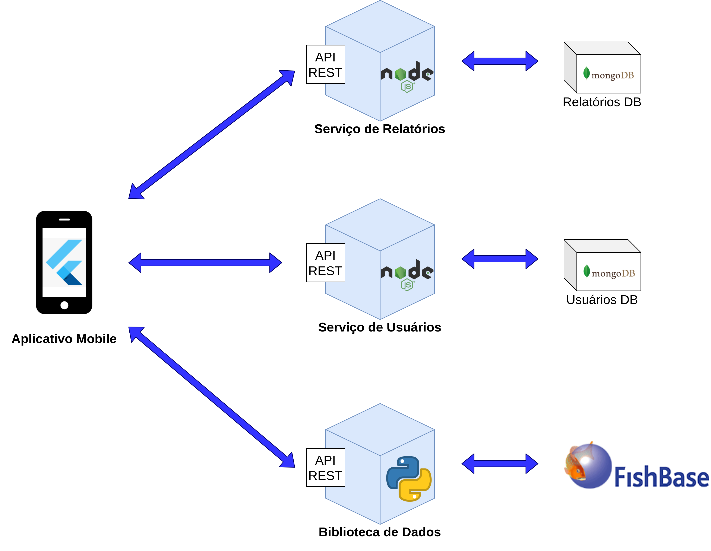

# Documento de Arquitetura

|    Data    | Versão |              Descrição              |                         Autor                          |
| :--------: | :----: | :---------------------------------: | :----------------------------------------------------: |
| 20/08/2021 |  0.1   | Criação do documento de Arquitetura | [Natan Tavares Santana](https://github.com/Neitan2001) |
| 20/08/2021 |  0.2   |              Tópico 4               | [Natan Tavares Santana](https://github.com/Neitan2001) |
| 21/08/2021 |  0.3   |              Tópico 1               |  [João Victor Batista](https://github.com/jvBatista)   |
| 21/08/2021 |  0.4   |              Tópico 2               | [Natan Tavares Santana](https://github.com/Neitan2001) |
| 21/08/2021 |  0.5   | Criação do tópico de Metas e restrições da arquitetura | [Paulo Henrique Rezende](https://github.com/phrezende-eng) |

## 1. Introdução

### 1.1 Finalidade

 &emsp;&emsp;Este documento de arquitetura tem como função apresentar uma visão sobre a arquitetura utilizada pelo aplicativo Pró-Espécies Peixes (nome em desenvolvimento) e mostrar como são feitas as conexões entre os elementos utilizados para que o software funcione. A comunicação dele com containers e banco de dados, são alguns destes elementos.

### 1.2 Escopo

 &emsp;&emsp;Pró-Espécies Peixes (nome em desenvolvimento) é um aplicativo mobile cuja finalidade principal é permitir a criação, edição, validação e exportação de relatórios de campo sobre espécies animais da área de ictiologia nativas do estado do Tocantins no Brasil, de modo a facilitar o levantamento e recolhimento de dados científicos de tais espécies para pesquisadores da região.

 &emsp;&emsp;Neste artigo serão exploradas todas as estruturas necessárias para o funcionamento do aplicativo e a devida arquitetura desse software, como por exemplo diagrama de classes, visão de casos de uso e visão lógica do produto.

### 1.3 Referências

- Como documentar a Arquitetura de Software. http://www.linhadecodigo.com.br/artigo/3343/como-documentar-a-arquitetura-de-software.aspx
- Documento de arquitetura ADA. https://fga-eps-mds.github.io/2019.1-ADA/#/docs/project/architecture_doc?id=_1-introdu%c3%a7%c3%a3o
- Documento de arquitetura Aix. https://fga-eps-mds.github.io/2019.1-Aix/projeto/2019/03/29/documento-de-arquitetura/

## 2. Representação da arquitetura

### 2.1 Diagrama de relações

O Pró-Espécies Peixes funciona com base na seguinte representação arquitetural:

 &emsp;&emsp;O projeto é modelado em arquitetura de microsserviços, que visa implementar pequenos serviços independetes e modularizados. Abaixo será explicado quais são os microsserviços e suas relações com os outros

#### 2.1.1 Serviço de Relatórios

 &emsp;&emsp;Esse microsserviço é responsável por tudo que é relacionado aos relatórios de peixes, desde a criação do relatório pelo pescador até a validação pelo pesquisador. Além disso, esse serviço permitirá ao pescador e ao pesquisador editar ou remover relatórios pendentes.

#### 2.1.2 Serviço de Usuários

 &emsp;&emsp;Esse microsserviço é responsável pelo gerenciamento de usuários na plataforma, como a criação e a diferenciação de tipos de usuários: Pescadores e Pesquisadores.

#### 2.1.3 Biblioteca de Dados

 &emsp;&emsp;Esse microsserviço é responsável pelo armazenamento de dados de Peixes coletados na FishBase ou cadastrados pelos Pesquisadores na plataforma a fim de disponibilizar informações que ajudem os pescadores a fazerem relatórios com dados mais exatos.

### 2.2 Tecnologias

#### Flutter

 &emsp;&emsp;Flutter é um kit de desenvolvimento de interface de usuário, de código aberto, criado pelo Google, que possibilita a criação de aplicativos compilados nativamente.

#### Node.js

 &emsp;&emsp;O Node.js é um ambiente de execução Javascript server-side, permitindo criar aplicações Javascript para rodar como uma aplicação standalone em uma máquina, não dependendo de um browser para a execução.

#### Python

 &emsp;&emsp;Python é uma linguagem de programação de alto nível, interpretada de script, imperativa, orientada a objetos, funcional, de tipagem dinâmica e forte.

#### MongoDB

 &emsp;&emsp;MongoDB é um software de banco de dados orientado a documentos livre, de código aberto e multiplataforma Classificado como um programa de banco de dados NoSQL, o MongoDB usa documentos semelhantes a JSON com esquemas.

#### Git

 &emsp;&emsp;Ferramenta de versionamento que será usada em conjunto com o GitHub para salvar os dados do decorrer do projeto, possibilitando a hospedagem e a geração de backups do mesmo.

#### Docker

 &emsp;&emsp;Ferramenta para gerar um ambiente isolado e construído especificamente para a equipe que será utilizado para facilitar o desenvolvimento do projeto.

## 3. Metas e restrições da arquitetura
## 3.1 Metas do Software Pró-espécies Peixes
Com o intuito de ajudar pesquisadores, pescadores convencionais e esportivos, Pró-espécies Peixes:
 - Guiar as personas na busca por certos tipos de peixes;
 - Ajudar pesquisadores a encontrar diferentes tipos de espécies de peixes;
 - Apresentar dados relevantes sobre peixes para todas as personas;
 - Coletar informação de peixes ainda não conhecidos;
 - Guardar a quantidade de peixes coletados de cada indivíduo;

## 3.2 Restrições da arquitetura
As restrições de arquitetura são:
 - Ter acesso à internet;
 - Possuir a plataforma atualizada para a última versão que o software requer;
 - Ter conta na App Store ou Play Store para qual for a plataforma usada;

## 4. Visão de Casos de Uso

### 4.1 Diagrama de casos de uso

### 4.2 Especificações dos casos de uso

|                   Casos de Uso                    |          Ator          |                                                 Descrição                                                 |
| :-----------------------------------------------: | :--------------------: | :-------------------------------------------------------------------------------------------------------: |
|             UC01 - Enviar Relatórios              |        Pescador        |              Preencher um relatório com os dados do peixe e enviar o mesmo para ser validado              |
|      UC02 - Enviar Relatórios posteriormente      |        Pescador        | Preencher um relatório do peixe e armazenar no celular para ser enviado assim que tiver acesso à internet |
|           UC03 - Acessar wiki de Peixes           | Pescador e Pesquisador |                           Acessar uma wiki com dados de peixes pré-cadastrados                            |
| UC04 - Disponibilizar relatórios para verificação |      Pesquisador       |                  Acessar relatórios feito por pescadores e visualizar os dados relatados                  |
|            UC05 - Confirmar relatório             |      Pesquisador       |                              Confirmar um relatório enviado por um pescador                               |
|          UC05 - Editar/Deletar Relatório          |      Pesquisador       |                    Editar ou deletar os dados de um relatório enviado por um pescador                     |