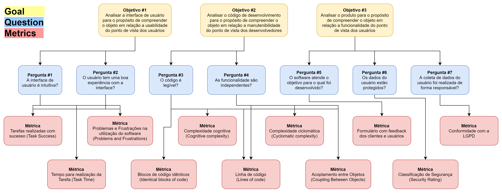

# Goal Question Metric

A GQM (_Goal Question Metric_) é uma abordagem orientada a objetivos que busca levantar métricas de software para a melhoria de processos. Essa abordagem possui três etapas principais:

1. Objetivo: primeiramente, define-se um objetivo sob uma perspectiva mais abstrata. Os objetivos definem o que a organização tem que melhorar (ex.: aumentar produtividade, diminuir tempo de desenvolvimento);
2. Questões: as questões são formuladas baseadas no objetivo. Elas refinam o objetivo de uma forma mais quantificável (ex.: quais são os gargalos de produtividade? Como podemos aumentar a quantidade de código produzido?
 Como diminuir o tempo de especificação?);
3. Métricas: as métricas são escolhidas para responder às questões (ex.: linhas de código (LOC) atual por desenvolvedor, tempo requerido para modelagem, quantidade de horas gasta com retrabalho).

## GQM Pró-Espécies Peixes

| **Objetivo #1** | |
| --- | --- |
| **Analisar** | A Interface de Usuário |
| **Para o propósito de** | Compreender o objeto |
| **Em relação a** | Usabilidade |
| **Do ponto de vista de** | Usuários |

| **Objetivo #2** | |
| --- | --- |
| **Analisar** | O código de desenvolvimento |
| **Para o propósito de** | Compreender o objeto |
| **Em relação a** | Manutenibilidade |
| **Do ponto de vista de** | Desenvolvedor |

| **Objetivo #3** | |
| --- | --- |
| **Analisar** | O produto |
| **Para o propósito de** | Compreender o objeto |
| **Em relação a** | Funcionalidade |
| **Do ponto de vista de** | Usuário |

| **Pergunta #1** | |
| --- | --- |
| **Pergunta** | A Interface de Usuário é intuitiva? |
| **Em relação a** | Compreensibilidade |
| **Referente ao(s) objetivo(s)** | Objetivo #1 |

| **Pergunta #2** | |
| --- | --- |
| **Pergunta** | O usuário tem uma boa experiência com a interface? |
| **Em relação a** | Aprendizagem |
| **Referente ao(s) objetivo(s)** | Objetivo #1 |

| **Pergunta #3** | |
| --- | --- |
| **Pergunta** | O código é legível? |
| **Em relação a** | Analisabilidade |
| **Referente ao(s) objetivo(s)** | Objetivo #2 |

| **Pergunta #4** | |
| --- | --- |
| **Pergunta** | As funcionalidades são independentes? |
| **Em relação a** | Testabilidade, Mutabilidade |
| **Referente ao(s) objetivo(s)** | Objetivo #2 |

| **Pergunta #5** | |
| --- | --- |
| **Pergunta** | O software atende o objetivo para o qual foi desenvolvido? |
| **Em relação a** | Precisão |
| **Referente ao(s) objetivo(s)** | Objetivo #3 |

| **Pergunta #6** | |
| --- | --- |
| **Pergunta** | Os dados do usuário estão protegidos? |
| **Em relação a** | Segurança |
| **Referente ao(s) objetivo(s)** | Objetivo #3 |

| **Pergunta #7** | |
| --- | --- |
| **Pergunta** | A coleta de dados do usuário foi realizada de forma responsável? |
| **Em relação a** | Conformidade |
| **Referente ao(s) objetivo(s)** | Objetivo #3 |

| **Métrica** | **Pergunta à qual se relaciona** |
| --- | --- |
| Tarefas realizadas com sucesso _(Task Success)_ | Pergunta #1, Pergunta #2 |
| Tempo para realização da Tarefa _(Task Time)_ | Pergunta #1, Pergunta #2 |
| Problemas e Frustrações na utilização do software _(Problems and Frustrations)_ | Pergunta #1, Pergunta #2 |
| Blocos de código idênticos _(Identical blocks of code)_ | Pergunta #3 |
| Complexidade cognitiva _(Cognitive complexity)_ | Pergunta #3 |
| Linha de código _(Lines of code)_ | Pergunta #3, Pergunta #4 |
| Complexidade ciclomática _(Cyclomatic__complexity)_ | Pergunta #3, Pergunta #4 |
| Acoplamento entre Objetos (_Coupling Between Objects)_ | Pergunta #3, Pergunta #4 |
| Formulário com feedback dos clientes e usuários | Pergunta #5 |
| Classificação de Segurança _(Security Rating)_ | Pergunta #6 |
| Conformidade com a LGPD | Pergunta #7 |

### Representação do GQM em diagrama

## Referências

- [http://www.arisa.se/compendium/node61.html](http://www.arisa.se/compendium/node61.html)
  - [http://www.arisa.se/compendium/node105.html#metric:CBO](http://www.arisa.se/compendium/node105.html#metric:CBO)
  - [http://www.arisa.se/compendium/node91.html#metric:LOC](http://www.arisa.se/compendium/node91.html#metric:LOC)
  - http://www.arisa.se/compendium/node96.html#metric:McCabe
- [SonarQube - Metric Definitions](https://docs.sonarqube.org/latest/user-guide/metric-definitions/)
- [Qualidade de Software - Engenharia de Software 29](https://www.devmedia.com.br/qualidade-de-software-engenharia-de-software-29/18209)
- [Matters of the HEART: How to Measure UI and UX Design](https://onix-systems.medium.com/matters-of-the-heart-how-to-measure-ui-and-ux-design-b7f29b77a711)
- Kshirasagar Naik, Priyadarshi Tripathy, Software Testing and Quality Assurance: Theory and Practice